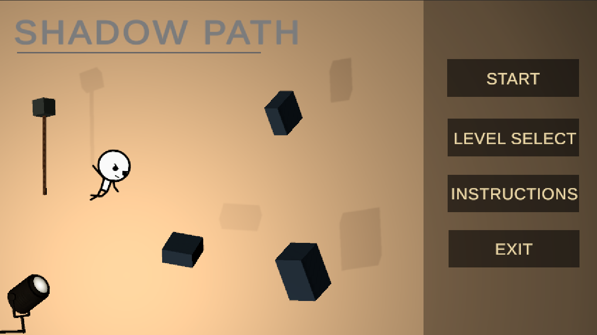

# FF_GamePro - ShadowPath

This repository contains my Game Programming coursework, including the main Unity game project, class exercises, planning evidence, testing records, asset credits, and agile development documentation.

The main coursework game is **ShadowPath**, a Unity 2.5D puzzle-platformer where the player reshapes projected shadows with light controls and uses those shadows as playable routes.

## Overview

`ShadowPath` is built around one core idea:

> Shadows are not only visual effects; they can become part of the playable level.

The game draws inspiration from Chinese shadow puppetry, where light, screens, and silhouettes are used to create movement and storytelling. In `ShadowPath`, this visual idea becomes a gameplay mechanic. The player controls a stickman character in a side-view platform environment, observes shadows cast by 3D objects, adjusts the active light direction, and uses the resulting shadow shapes to cross gaps, climb routes, swing from rope shadows, and complete each level.

The intended experience is thoughtful and experimental: observe the scene, adjust the light, test the shadow path, and move carefully toward the level goal.

The active Unity project is stored in [ShadowPath/](ShadowPath/). Supporting documentation is stored in [docs/](docs/).

## Project Links

| Area | Link |
| --- | --- |
| Public Kanban board | [ShadowPath Kanban](https://github.com/users/ColdFF/projects/1) |
| Issue tracker | [GitHub Issues](https://github.com/ColdFF/FF_GamePro/issues) |
| Pull request history | [GitHub Pull Requests](https://github.com/ColdFF/FF_GamePro/pulls) |
| CI workflow runs | [GitHub Actions](https://github.com/ColdFF/FF_GamePro/actions) |
| Main Unity project | [ShadowPath/](ShadowPath/) |
| Documentation folder | [docs/](docs/) |

## Gameplay Preview

<table>
  <tr>
    <td width="50%" align="center">
      
       
      Main menu and level entry flow.
    </td>
    <td width="50%" align="center">
      
       
      Level 04: adjusting the light to form a shadow ladder.
    </td>
  </tr>
</table>

## Key Features

- Four playable ShadowPath levels connected through a main menu and level flow.
- Light-controlled shadow-platform traversal.
- Runtime projected shadow edge colliders used as walkable routes.
- Shadow ladder climbing in `Level02_HiddenDoor`.
- Moving shadow platforms and rope-shadow swinging in `Level03_RopeTower`.
- Dual-light phase switching in `Level04_DualLight`.
- Main menu, instruction popups, pause menus, level-complete UI, and return-to-menu flow.
- Gameplay audio for jumps, footsteps, shadow footsteps, light cues, door movement, failure feedback, and UI interactions.
- Iterative development evidence through GitHub Issues, pull requests, a public Kanban board, testing logs, and daily scrum notes.

## How To Run ShadowPath

1. Clone or download this repository.
2. Open Unity Hub.
3. Add the [ShadowPath/](ShadowPath/) folder as a Unity project.
4. Open the project with Unity `2022.3.62f3 LTS`.
5. Open the scene `Assets/Scenes/MainMenu.unity`.
6. Press Play in the Unity Editor.

The main menu loads the playable levels in order:

1. `Level01_Tutorial`
2. `Level02_HiddenDoor`
3. `Level03_RopeTower`
4. `Level04_DualLight`

## Controls

| Action | Input |
| --- | --- |
| Move left / swing rope left | `A` |
| Move right / swing rope right | `D` |
| Run | `Shift` + `A` / `D` |
| Jump | `W` or `Space` |
| Climb up when on a ladder | `W` |
| Climb down / detach near ladder bottom | `S` |
| Auto-grab rope shadow | Jump into a rope-shadow grab zone |
| Release rope while swinging | `Space` |
| Boost rope swing | Hold `Shift` while swinging |
| Adjust active light direction | Arrow keys |
| Switch active light phase in Level 04 | `F` |
| Pause / resume gameplay | `R` |

## Technical Highlights

| System | Evidence |
| --- | --- |
| Player movement and feel | [PlayerController.cs](ShadowPath/Assets/Scripts/PlayerController.cs) handles walking, running, jumping, coyote time, jump buffering, slope movement, shadow carry, and external launch momentum. |
| Shadow platform generation | [ProjectedShadowAllEdgePlatform.cs](ShadowPath/Assets/Scripts/ProjectedShadowAllEdgePlatform.cs) projects caster geometry onto the shadow screen and generates runtime collider strips for walkable shadow edges. |
| Shadow ladder interaction | [ShadowLadderClimbZone.cs](ShadowPath/Assets/Scripts/ShadowLadderClimbZone.cs) supports automatic ladder grabbing, climbing, pausing climb animation, bottom detach, and top exit behaviour. |
| Rope-shadow swinging | [ShadowRopeSwingZone.cs](ShadowPath/Assets/Scripts/ShadowRopeSwingZone.cs) handles rope-shadow grabbing, swing input, release momentum, and forced release when a shadow state changes. |
| Dual-light level logic | [Level04DualLightController.cs](ShadowPath/Assets/Scripts/Level04DualLightController.cs) switches between Phase A and Phase B lights and updates phase-bound shadow platforms, ladders, and rope zones. |
| Menu and scene flow | [ChapterTransitionManager.cs](ShadowPath/Assets/Support_UI_Transition/ChapterTransitionManager.cs) supports chapter-style scene transitions from the main menu and between levels. |

## Repository Structure

| Folder / File | Purpose |
| --- | --- |
| [ShadowPath/](ShadowPath/) | Main coursework Unity project. |
| [docs/](docs/) | Planning, testing notes, asset credits, agile records, and development reflections. |
| [2D_Demo_Improvement/](2D_Demo_Improvement/) | Improved version of a 2D shooter class demo. |
| [SolarSystem/](SolarSystem/) | Solar system Unity class demo. |
| [Lecture_Q&A/](Lecture_Q%26A/) | In-class questions, answers, and discussion work. |
| [Welldone!!_post/](Welldone!!_post/) | In-class group activity posts. |
| [Prototype.png](Prototype.png) | Early concept sketch kept as process evidence, although the current game design has changed. |

## Documentation

| Document | Purpose |
| --- | --- |
| [docs/Game_Concept.md](docs/Game_Concept.md) | Game concept, design goals, scope, risks, target audience, and success criteria. |
| [docs/Development_Workflow.md](docs/Development_Workflow.md) | Git workflow, Kanban process, issue usage, testing notes, and definition of done. |
| [docs/Asset_Credits.md](docs/Asset_Credits.md) | External asset sources, licences, access dates, intended use, edits, and AI-assisted asset notes. |
| [docs/Testing_Log.md](docs/Testing_Log.md) | Feature tests, bug checks, retesting evidence, and regression notes. |
| [docs/Daily_Scrum.md](docs/Daily_Scrum.md) | Agile-style development reflections across the project timeline. |

## Development Process

This project follows an iterative development process:

1. Build a focused playable vertical slice.
2. Prioritise one clear core mechanic: using shadows as platforms.
3. Keep the scope realistic for the coursework timeframe.
4. Commit progress through feature branches and pull requests.
5. Track work using the public [ShadowPath Kanban board](https://github.com/users/ColdFF/projects/1).
6. Test features after each meaningful change.
7. Record design decisions, technical issues, asset usage, and improvements.

The repository is maintained as evidence of steady development, including issues, pull requests, CI checks, documentation updates, and testing records.

## Assessment Focus

This repository is maintained as evidence of:

- A clear and realistic game concept.
- Unity gameplay programming and scene development.
- Iterative development and steady progress.
- Testing, debugging, and refinement.
- Responsible asset use and credit documentation.
- Reflection on design and technical decisions.

## Asset Credits

External assets are recorded in [docs/Asset_Credits.md](docs/Asset_Credits.md), including source page, creator, licence, access date, intended use, and any edits made.

## License

The original source code and project documentation authored for this repository are available under the [MIT License](LICENSE).

Third-party assets, audio, fonts, images, and other externally sourced materials are not relicensed by this repository. They remain under their original licences and are documented in [docs/Asset_Credits.md](docs/Asset_Credits.md).

## Build Information

The game is developed using:

- Unity `2022.3.62f3 LTS`
- 3D Built-in Render Pipeline
- Target platform: Windows
- Current run path: Unity Editor through `Assets/Scenes/MainMenu.unity`
